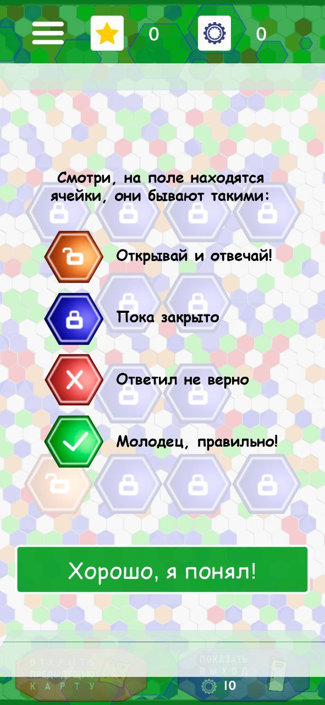
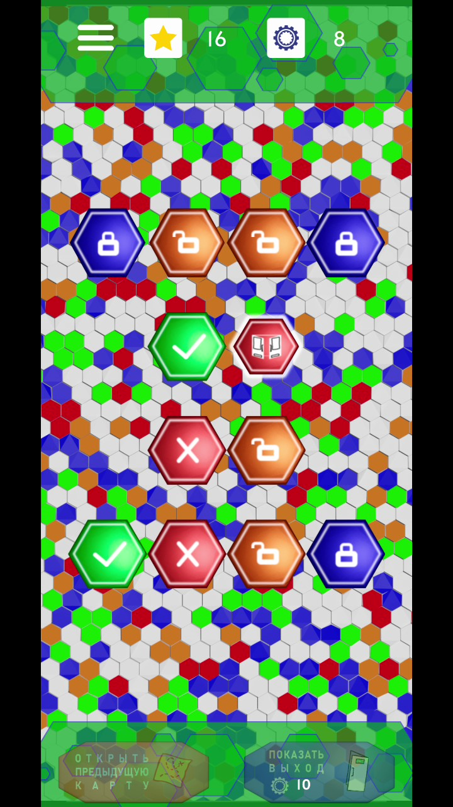

# Описание
Эта игра - часть другого приложения, поэтому в "гамбургеге" есть пункт с главным меню 
В игре все спрайты либо нарисованы в Photoshop, либо отрендерены в Blender
Музыка бесплатная, с открытых источников

Есть анимации.
Вопросы в викторину можно записывать через Excel файл (для удобства пользователей), путь до следующего уровня и расположение ячеек затается так же в Excel
Можно использовать различное количество ответов
После ответа открывается подробное объяснение

# Геймплей
При первом запуске появляется обучение

|  |  |  |
|--------------------------------------------------------|--------------------------------------------------------|--------------------------------------------------------|

Для прохождения открывайте ячейки по очереди и отвечайте на попросы, правильный ответ дает валюту, которую можно использовать для открытия следующего уровня.
После ответа на вопрос, открываются соседние ячейки
Под одной из ячеек находится дверь для перехода на следующий уровень, она откроется после ответа на вопрос над этой дверью
Для перехода на предыдущий уровень нажмите на кнопку в футере

|  |  |  |  |
|-------------------------------------------------------|-------------------------------------------------------|-------------------------------------------------------|-------------------------------------------------------|

Небольшая демонстрация анимаций

|  |
|---------------------------------------------------------|